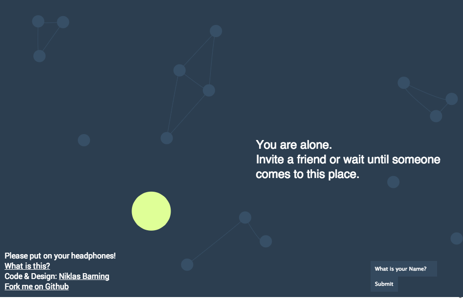

babel
=====

Babel is a web app that abstracts verbal communication. Visitors are shown as circles.

Please put on your headphones, or the audiosignal will be disturbed.

It's build with [Node.js](http://nodejs.org/), [Socket.io](http://socket.io/) and [P5.js](http://p5js.org/).

##Screenshot

